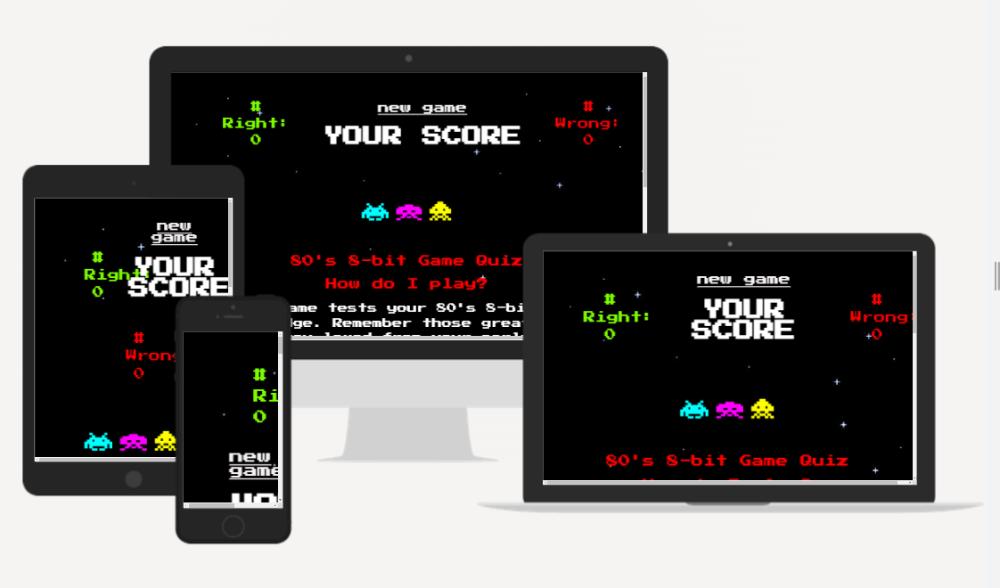

# 🎸 **Cassette Crusadars** 👽 

Always wanted to test your hand at 8-bit games and their music? Well now is your chance!. This game tests your 80's 8-bit game knowledge. Remember those great music tracks you loved from your early games, well now you can put your skills to the test!

## How to play

-Head to each question, then click to play the music track.
-Choose which 80's 8-bit game you think the music is from.
-Make your choices and compare your hi-scores with others!

## Setup

### Deployed link

[Click here to play!](https://www.example.com)

### How to install

1. Double click setup.exe
2. Follow onscreen instructions

## Credits

* [Be sure to credit any assets that are not yours](https://www.example.com)
* [Member 1 Linkedin](https://www.linkedin.com)
* [Member 2 Linkedin](https://www.linkedin.com)
* [etc. etc.](https://www.example.com)