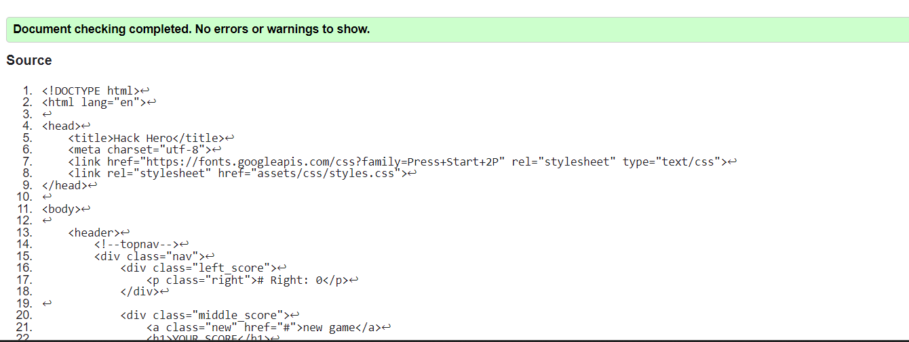
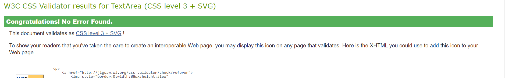
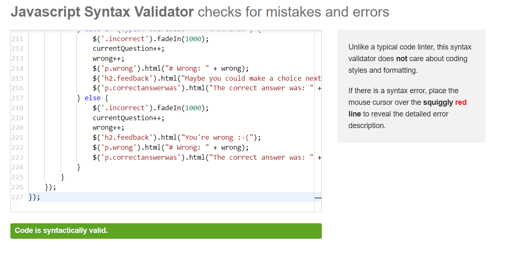

# 🎸 **Cassette Crusaders project Stranger-bits** 👽 

Always wanted to test your hand at 8-bit games and their music? Well now is your chance!. This game tests your 80's 8-bit game knowledge. Remember those great music tracks you loved from your early games, well now you can put your skills to the test!

## How to play

-Head to each question, then click to play the music track.

-Choose which 80's 8-bit game you think the music is from.

-Make your choices and compare your hi-scores with others!

## Wireframes

Wireframes created using Balsamiq Wireframes

Landing Page with How to Play instructions

Main quiz screen with multiple choice thumbnails

Answer selection for thumbnails

Modal showing correct answer

Modal showing incorrect answer

Game over screen

### Deployed link

[Click here to play!](https://becky139.github.io/Hack-hero/)

## Testing
## Automated Testing

### Code Validation
The [W3C Markup Validator](https://validator.w3.org/) service was used to validate the `HTML` and `CSS` code used.

**Results:**

- Home Page

     

- CSS Code

     

- Java Script

     
    

## Credits

* [Rebecca Marriott Linkedin](https://www.linkedin.com/in/rebecca-marriott-492571148/)
* [Niklas Färeborg Linkedin](https://www.linkedin.com/in/niklas-f%C3%A4reborg-1bb353211/)
* [Dean Fay Linkedin](https://www.linkedin.com/in/dean-fay/)
* [Onuorah Joshua Nwani Linkedin](https://www.linkedin.com/in/onuorah-joshua-nwani-952a06211)

Images taken from graphicriver.net
Audio downloaded from their respective game trailers on YouTube
